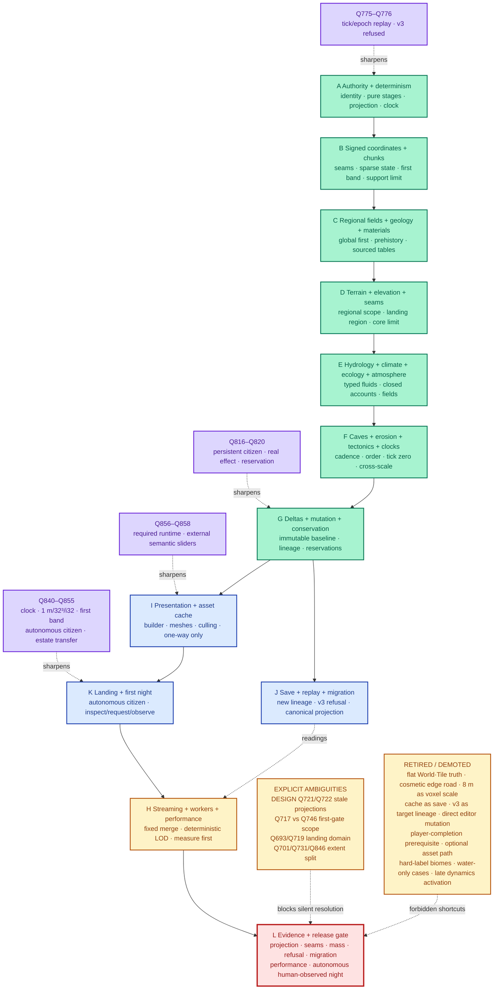

# World-generation grilling structure

This is the short visual companion to `world-generation-grilling-structure.excalidraw`. The long engineering argument and all 91 WG rows live in [`../world-generation-grilling-map.md`](../world-generation-grilling-map.md); this page is a decision-flow overview, not a second authority.

## Visual argument



## Reading order

1. **Purple rail:** later C11 target decisions amend the original WG pass; they do not announce implementation completion.
2. **Green spine:** identity and supported coordinates precede coupled fields, terrain, Earth systems, dynamic processes, and conserved deltas.
3. **Blue branches:** CAP-007 persistence, CAP-010 presentation, and founding-day UX consume the world/delta contract through separate authority boundaries.
4. **Amber floor:** worker/performance behavior and all known record ambiguities remain explicit; measurements do not choose semantics.
5. **Red floor:** the generator/new-save/first-night gate remains blocked until every named evidence class exists.

## Critical forks

- **No universal seed guarantee:** a valid golden seed proves the founding loop; an impossible founder site is a separate honest edge case (WG-Q13, WG-Q16, WG-Q57, WG-Q72).
- **First band is not the long-term core:** Q846 freezes the first target's `z=-16..+47`; Q731 still requires a finite supported-core refusal for the longer target.
- **First-slice order is not gate order:** early substrate/dynamics prototypes may precede broad generator work, but Q746 and Q724 prohibit treating a world without correct tick-zero dynamics as accepted.
- **Presentation is downstream:** the Dynamic Asset Generator is required, but recipe/hash/builder-tool/cache changes never alter CAP-001 truth (WG-Q82, WG-Q85, WG-Q89; Q856–Q858).
- **Human gate changed:** the first human observes an autonomous citizen's attempt; player physical completion is no longer a prerequisite (Q852).

## Rendering and review guide

- Open the native source in Excalidraw: `docs/design/diagrams/world-generation-grilling-structure.excalidraw`.
- Read the diagram left-to-right across the green spine, then follow the blue authority branches to the amber and red evidence floors.
- Green means a settled contract, not completed code. Purple means a later amendment. Blue is downstream persistence/presentation/UX. Amber is measured or disputed. Red is blocked.
- The canonical full-Q traceability and disputed mappings are in `docs/design/world-generation-grilling-map.md`; do not use the cluster nodes as a substitute for that matrix.
- Optional official render command from the repository root:

```text
uv run --with playwright python docs/design/diagrams/render_excalidraw.py docs/design/diagrams/world-generation-grilling-structure.excalidraw docs/design/diagrams/rendered/world-generation-grilling-structure.png --scale 2
```

**Native source:** `docs/design/diagrams/world-generation-grilling-structure.excalidraw`
**Detailed synthesis:** `docs/design/world-generation-grilling-map.md`
